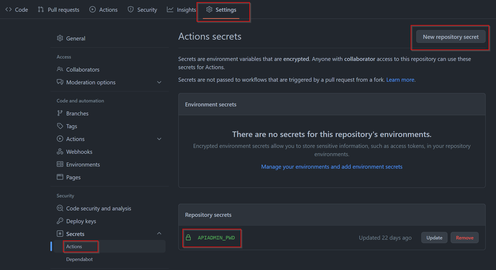

# Register APIs in Axway API Manager

This project enables you to quickly deploy/register APIs of your choice to Axway API Manager and mock their output (if needed) by using [Stoplight Prism server](https://stoplight.io/open-source/prism). The APIs must be provided in the *./APIs* folder as OAS specifications in JSON format.

## Requirements

These are the requirements to successfully use this project:

- Linux machine with Axway API Management installed
- API Manager URL has to be accessible from Internet
- Docker installed (Docker version 20.10.17 was tested)
- Git installed
- API specs Swagger v2 or OAS v3 in JSON format with the 'Dereferenced' references (as shown in Stoplight Studio)


   


## Running this project

Follow these steps to use this project:

1. Fork this project to your GitHub account

2. Clone it to your machine where you run Axway API Management. FYI, for our testing we've used CentOS 7 machine with Axway API Management v.7.7.20220530 installed. 

3. Add your API specs in JSON format to `./APIs/mocked` folder. 

4. Modify the *`./config/script-config.json`* file by editing the default API Manager URL and `apiadmin` user ID (this user must have permissions to register APIs) with values for your target environment.

5. Modify **organization** value in the `./config/API-config.json` file if needed. The default organization where the APIs will be installed is *API Development*.

6. Push these updates to your repo

7. Access your project in *github.com* and add a password variable **APIADMIN_PWD** (it must be this name) to your project (***Settings > Secrets > Actions***). This is a safe way for providing sensitive information for using in GitHub Actions.


   


8. Click the **Action** tab. You will need to click the **I understand my workflows, go ahead and enable them** link. 

9. Select **Deploy to APIM**. Click **Run workflow**. The action will prompt you for an input parameters: git branch. You can accept the default values and click **Run workflow** in the pop-up window.


   


10. GitHub executes this action in a container on its cloud. It will take a minute or so to complete. Come back to this page later and check the status. If the action is successful, you should see a green checkmark (like in the image above). If the workflow fails, you will need to click it in the *workflow runs* pane and review the logs. Correct an issue and re-run the workflow. FYI, Visual Studio Code has a nice plug-in to work with [GitHub Actions](https://marketplace.visualstudio.com/items?itemName=cschleiden.vscode-github-actions).

   Note: If the same API already registered in your API Manager, the deployment of that API will fail. You may modify the `.github/workflows/main.yml` and add the **-force** parameter at the end of the `apim-cli-$ENV.CLI-RELEASE/scripts/apim.sh` command

11. Connect to your API Manager to confirm that APIs are registered.

12. Now, go back to your Linux machine where you have Axway API Management and git repo. Switch to your git repo folder.

13. Execute the following commands from within this folder

    ```bash
    $ chmod +x post-run-task.sh
    $ ./post-run-task.sh
    ```

14. This script will deploy multiple containers of the Prism mocking server on your machine: one per API spec in the `*./APIs*/mocked` folder. The containers use one port per container starting with 4010.

    **Note**: make sure that you have enough resources to run Axway APIM and multiple docker containers

15. Test your APIs. The mocked data will return the "lorem ipsum" data unless you create your data models with the specific data type (like date or enum) and/or [x-faker tags](https://fakerjs.dev/guide/) to "help" Prism in generating more realistic data. The following APIs are an example of using x-faker: [Account-Information.json](./APIs/mocked/Account-Information.json) and [Payments.json](./APIs/mocked/Payments.json). These are sample request and response generated by Prism:

   


   Another option is to use examples if you have them in your API spec files. To use this option, you need to modify the `post-run-task.sh` script. Remove the second `-d` option from the `docker` command:

   
